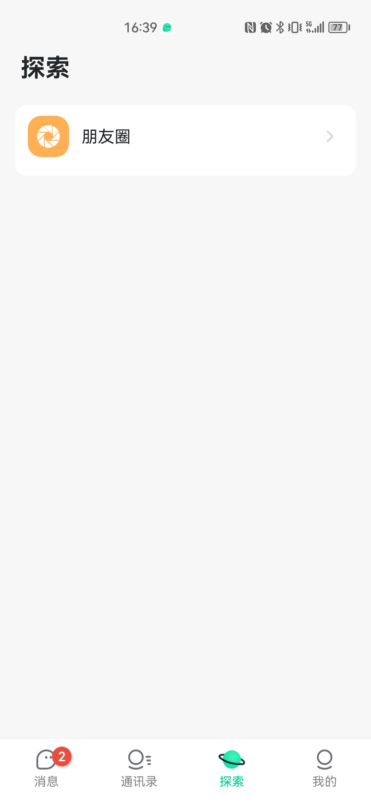

# 项目简介
客户端源码及详细部署文档联系 qq435924831   
# 各个服务介绍
1. app/infra/databus分布式数据同步系统
2. app/service/media媒体库
3. app/service/auth_session golang用户微服务
4. app/messenger/msg/inbox 电子邮件
5. app/messenger/msg/msg 消息
6. app/messenger/sync 同步服务
7. app/messenger/push 推送服务
8. app/messenger/webpage TCP连接web服务
9. app/bots/botfather TG的bot服务
10. app/bots/gif 动图
11. app/job/admin_log 后台日志
12. app/job/scheduled 多线程调度服务
13. app/admin/api_server 接口服务   http://127.0.0.1:8880  Authorization  170e302355453683:3d0e8db7bed0503949e545a469789279
14. app/interface/session golang微服务
15. app/interface/gateway 通讯层服务
16. app/interface/botway TG的bot服务
17. app/interface/relay tcp服务
18. app/interface/wsserver ws消息服务
19. app/messenger/biz_server 控制层服务模块

# 项目简介
系统优势：单台服务器可承载万人并发同时在线，需求大，可做集群。强大的并发。不需担心。

1. 支持二次开发和修改，通信无需任何第三方通信，安全和数据自己掌握，隐私有保障
2. 可自己安全部署，无需担心数据丢失，有漏洞。
3. 网上大部分第三方平台插件，无独立数据库及后台，按用户数收费，且安全性得不到保障，本系统不依赖第三方通信，可一直免费使用
4. APP端全纯原生开发，各种功能应有尽有。

# 主要功能

1. 创建群:可任意创建群，群成员数量不受限制，好友数量不受限。
2. 群功能：设置群二维码，群公告，昵称，头像，群共享文件，顶置聊天，消息免打扰，屏蔽群信息，指定某人单独禁言，全体禁言，举报，群管理，查找聊天记录，消息过期销毁，清空聊天记录等等功能。
3. 群管理：群主管理权转让，指定管理员，指定隐身人，一键复制新群，指定监控人，对群成员备注，私密群组，显示已读人数，群邀请确认，群组减员设置，允许显示群成员，允许普通成员私聊，允许普通成员上传文件等等功能
4. 群消息销毁：群主和管理可以撤回群内任何消息等等功能。
5. 群聊天：文字，语音，收藏，照片，小视频，GIF动态图，推送名片，传送文件，消息通知，发送位置，引用回复，转发，撤回，复制，删除，多选，发红包，群助手，@提示，@全体成员，消息逐条转发，合并转发，合并分享和收藏，合并删除和保存等等功能。
6. 好友聊天：文字，语音，音视频通话，收藏，照片，小视频，GI动态图各种表情，传送文件，发送位置，引用回复，撤回，复制，删除，收藏，撤回，录制，多选，发红包，转账，消息逐条转发，合并转发，合并分享和收藏，合并删除和保存等等功能。
7. 其他功能简单概述：添加朋友，扫一扫，收付款，附近的人，通讯录分组，阅后即焚，置顶聊天，消息免打扰，聊天背景，清除双方聊天记录，转账记录，查看聊天记录，自定义链接。
8. 后台功能：查看聊天记录二人聊天记录，查看群组聊天记录，查看单人所有聊天记录一键清除客户端所有聊天内容
9. 朋友圈：可以发送，图文，语音，视频，。可以点赞，评论，举报等等功能。
10. 用户管理：登录时间，封禁用户，更换头像，更换名称，设置密码。批量生成用户。
11. 会员登录：注册登录，短信登录。
12. 账号设置：修改密码，皮肤切换，字体设置，一键群发好友消息等等功能。
13. 后台管理：数据总览，系统配置，客户端配置，服务端配置，用户管理，角色管理，群组管理，单聊管理，红包管理，系统账单管理等等功能管理功能。
14. 所有用户：消息群发默认好友，配置默认好友，可一键发送消息。
15. 红包及充值功能

# 主要截图

